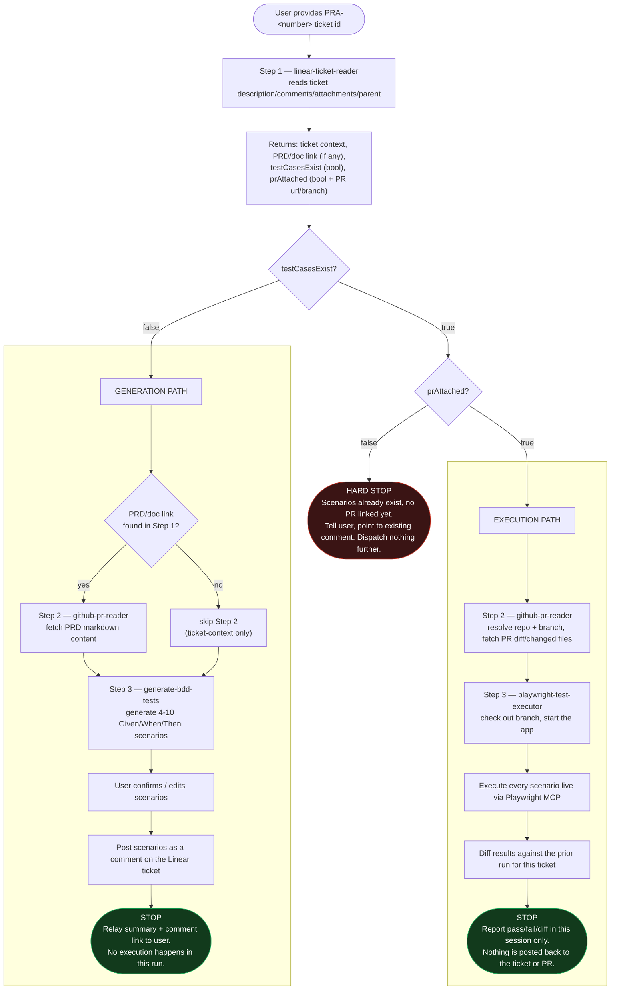

# AI Test Orchestrator — Pipeline Flowchart

This diagram maps the end-to-end pipeline implemented by the `ai-test-orchestrator` agent (`ai-test-orchestrator/agents/ai-test-orchestrator/AGENT.md`), which dispatches to four skills — `linear-ticket-reader`, `github-pr-reader`, `generate-bdd-tests`, and `playwright-test-executor` — to turn a single Linear ticket id into either posted BDD test scenarios or a live pass/fail test report.

## Reading the diagram

1. **Every run starts at Step 1** (`linear-ticket-reader`) — the orchestrator never assumes state from a previous turn and never skips this step.
2. The ticket's current state (`testCasesExist`, `prAttached`) is the **only** thing that decides which of the three outcomes happens:
   - **No scenarios yet** → Generation Path (Step 2 optional, Step 3 always generates + posts).
   - **Scenarios exist, no PR yet** → Hard stop, nothing dispatched.
   - **Scenarios exist and a PR is linked** → Execution Path (Step 2 mandatory, Step 3 runs the app for real).
3. The orchestrator itself never calls Linear, GitHub, or Playwright MCPs directly — every box above other than the decision diamonds and the `Start`/stop nodes is delegated to a dedicated skill via the `Skill` tool.
4. A **generation** run and an **execution** run never happen in the same pass — a ticket that just had scenarios generated has no PR yet by definition, so Step 3b never fires in the same run as Step 3a.

## Relation to this hackathon's demo feature

The product filter/search-box feature described in [`prd.md`](./prd.md) is the concrete feature this pipeline is meant to be exercised against: a Linear ticket describing that feature (linking `prd.md`) is the intended input to `Step 1`, `generate-bdd-tests` is expected to turn its Functional Requirements (FR1–FR16) and edge cases into BDD scenarios, and — once implemented and a PR is opened against `playwright-study` — `playwright-test-executor` is expected to run those scenarios live against the running app.
